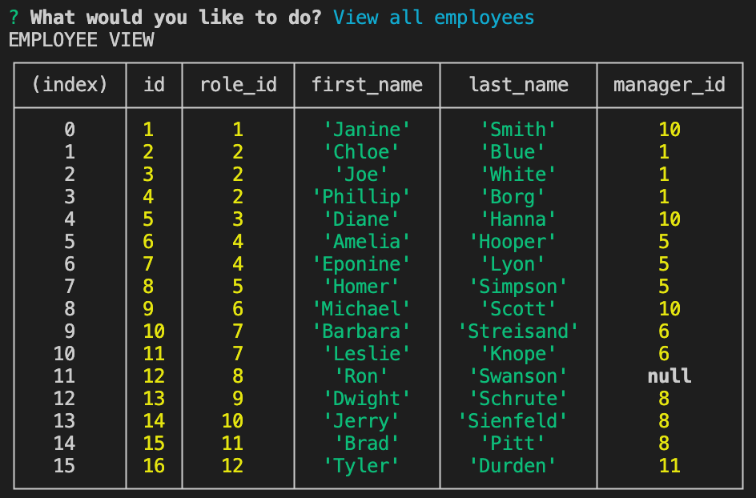

# Employee Tracker
Week-12 Homework - Mysql
## Desciption 
A command-line-input application that allows a business owner to view employees, departments and roles in the company. The user can simply view departments, employees and the roles available in a company, and also update employee roles. It uses Node.js to run, and mysql to store company data.
## Table of Contents
* [Installation](#installation)
* [Usage](#usage)
* [Contributing](#contributing)
* [GitHub-Repo](#github)
* [Questions](#questions)
## Installation
To set up for this application, the user first needs to run 'npm install' in the terminal. Upon installation of the required packages, the user then needs to log in to mysql and source the schema.sql, and seeds.sql files to download the database that is to be used. After this, the user then needs to input 'Node server.js' into the terminal, and the user is then prompted with the options available to navigate through the company database.
```
npm install
```
## Usage
Upon starting the application, the user is prompted with a series of questions that can view current data, add new data, or update an employee role. After selection of any of the 'View' options, the data is displayed in a table, and the questions are prompted again underneath. Upon selection of the 'Add new department' option, the user is prompted to input the name of the new department. Once entered, the department name is added to the current list of department names, and the list of user options is again prompted. Upon selection of the 'Add a new role' option, the user is asked to input the title of the new role, the salary of the new role, and to select the department that the new role belongs to. Once the new data is inputted, the answers are saved, the database is updated, and the initial options are prompted again to the user. If the user wishes to add a new employee, the 'Add new employee' options should be selected. A series of questions are then displayed to obtain the new employee first name, last name, and employee role. Again, once the questions are answered, the database is updated and the initial prompts are displayed. Finally, if the user wishes to update an employee role, simply select this option, and a series of prompts are shown to obtain the employee that the user wishes to update, and the options to what roles the user can update it to. If the user no longer wishes to navigate the organisation, simply select the 'Exit' option, and the application will terminate.
## Contributing
To contribute to this project, you can clone the respository on GitHub and create and branch where you can make any additions/adjustments. If you would like to commit these changes, you can create a pull request so the changes can be reviewed and merged.
## GitHub
[Employee-tracker](https://github.com/ahooper00/employee-tracker-mysql)
## Questions
* [My-github](ahooper00@github.com)
* ahooper97@gmail.com




[Video-of-deployed-application-here](https://drive.google.com/file/d/1GIAnAmFWMJ-TvMNwiGyPNrvn4R99LizD/view)